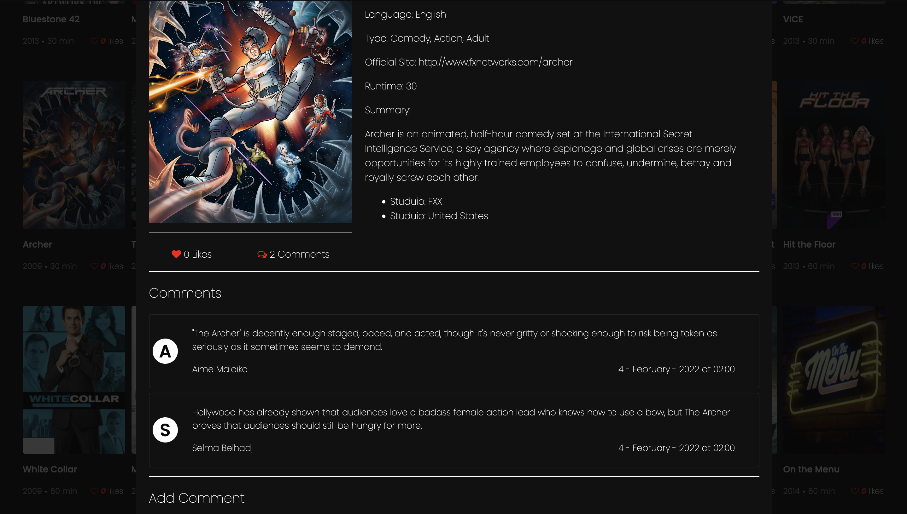

# LEADBOARD APP
> Awesome TV is the First and Original streaming entertainment network for Global Africa from United States of America (USA).

## Built With
- HTML & CSS & JavaScript
- Html, Css & JavaScript linters
## Live Demo
> ###### [LIVE DEMO LINK](https://aimemalaika.github.io/awesome-tv/)
##### Getting Started
- clone the repository by running\
    `git clone https://github.com/aimemalaika/awesome-tv.git`
- navigate to the folder\
    `cd awesome-tv`
- Install packages\
    `npm install`
- Run the app\
    `npm start`
- Create build app\
    `npm run build`
- Test Linters app\
    `npm run check-linters`
## Authors 

👤 **Aime Malaika**
- GitHub: [@aimemalaika](https://github.com/aimemalaika)
- Twitter: [@aimemalaika](https://twitter.com/Aime_Malaika)
- LinkedIn: [aimemalaika](https://linkedin.com/in/aimemalaika)

👤 **Oyelakin Ridwan Adio**
- GitHub: [@oyelakin](https://github.com/oyelakinG9)
- Twitter: [@oyelakin](https://twitter.com/OyelakinG1)
- LinkedIn: [@oyelakin](https://www.linkedin.com/in/oyelakin-ridwan-4b4a02b6/)

## :handshake: Contributing
Contributions, issues, and feature requests are welcome!
## Show your support
Give a :star:️ if you like this project!
## :memo: License
This project is [MIT](./MIT.md) licensed.